# 5G Data Streaming

## The Problem

Telecommunication companies produce data **extremely fast.**

To make use of this data, companies need to **capture, transform, and analyze it in real time.** They also need to store the data in an easy format for future use (AI model training etc).

But sometimes, this data comes in so quickly that it can overwhelm a traditional database. So **we require an intermediary buffer** (Data Grid) for fast reads and writes.

## The Architecture

Our architecture will generate data from cell devices, transform it, and store it in our cache for fast operations. We’ll also hook up a dashboard to see what's going on in our cell tower.

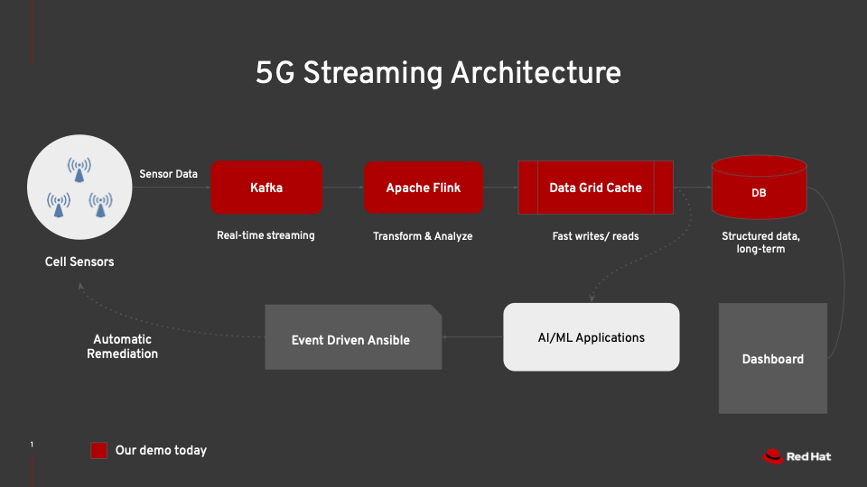

## Deploy AMQ Streams (Kafka)

We’ll use AMQ Streams to handle events being generated from our cell devices.

**First, we’ll install the AMQ Streams Operator.** On the left menu of the OpenShift console, select `Operators → OperatorHub` and type `AMQ Streams`. Click Install. Make sure the Installed Namespace is `openshift-operators`. Click Install again.

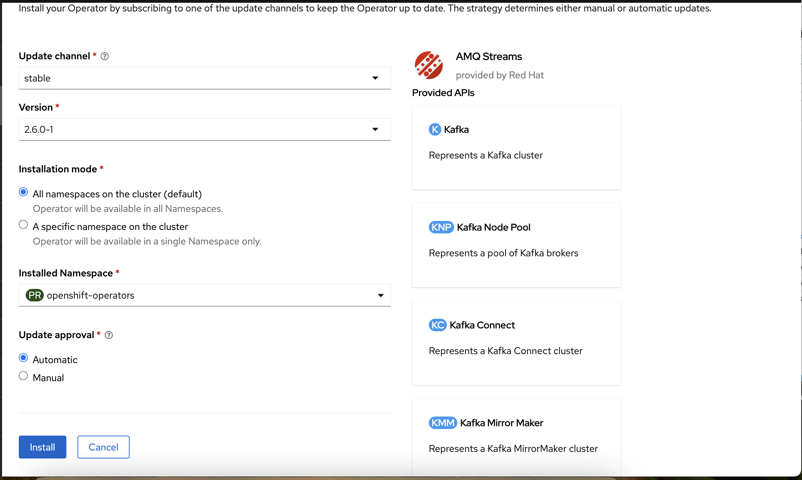

After the operator finishes installing, we’ll **create a new Kafka cluster.** On the left menu, select `Operators → Installed Operators` and click “AMQ Streams”. Under “Provided APIs”, create an instance of Kafka. Name the cluster `my-cluster` and use the default settings. Click `Create`.


Finally, we’ll create a topic to stream our call events. In the horizontal menu, select Kafka Topic. Click `Create Kafka Topic` and name the topic `call-records`.

## Deploy Data Grid & MySQL Storage

We’ll use data grid to cache our call events for quick access. Data Grid is a distributed, in-memory cache that accelerates data processing.

First, **we’ll install the Data Grid Operator.** On the left menu, select `Operators → OperatorHub` and type `Data Grid`. Click Install. The Installed Namespace should be `openshift-operators`. Click Install again.

After the operator finishes installing, **create a new data grid cluster.** On the left menu, select `Operators → Installed Operators` and click “Data Grid”. Select "Infinispan Cluster" under the provided APIs.

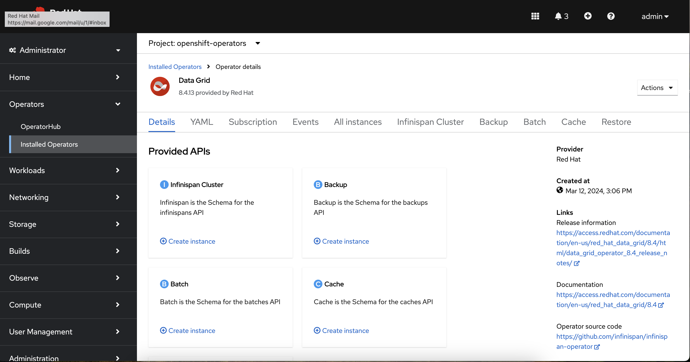

**Switch to the YAML view.** Replace everything in the editor with the configuration below.

```
apiVersion: infinispan.org/v1
kind: Infinispan
metadata:
  name: datagrid
  namespace: openshift-operators
spec:
  security:
    authorization:
      enabled: false
    endpointEncryption:
      type: None
    endpointAuthentication: false
  dependencies:
    artifacts:
      - maven: 'com.mysql:mysql-connector-j:8.3.0'
  replicas: 1
```
This creates a single-replica data grid cluster. It also downloads a connector that we’ll use to save our cache data to mysql.

### Deploy MySQL

After our call records get stored in cache, we’ll put them in a MySQL database for future access.

On the left menu, **click “Administrator” and switch to the developer view.** Select the `openshift-operators` project. Click `+Add` and select `Databases` under the developer catalog.


Select mysql (Ephemeral), click `Instantiate Template`, and use the properties below.

```
Database Service Name: sensordb
MySQL Connection Username: tolarewaju3
MySQL Connection Password: tolarewaju3
MySQL Connection root user password: myP@ssword!
MySQL Database Name: sensor
```
Click Create. **Wait for the pod to fully deploy.** You should see a blue filled circle appear over the pod.

Finally, we’ll create a table to store our call events. Under topology, click on the `sensordb` application, click the pod name, and select `Terminal.`


Login to our mysql server with the password (tolarewaju3).

`mysql -u tolarewaju3 -p`

Change the database to sensor.

`USE sensor;`

Create a table for our call records.
```
CREATE TABLE call_record (
    id INT PRIMARY KEY,
    timestamp TIMESTAMP NOT NULL DEFAULT CURRENT_TIMESTAMP,
    location varchar(255),
    signalStrength varchar(255),
    network varchar(255)
);
```
## Deploy Apache Flink

Cell data is often unstructured, so we’ll use Apache Flink to **transform it and store it in data grid.**

First, **install the Flink Operator.** Switch back to the Administrator view. On the left menu, select Operators → OperatorHub and type `Flink`. Click Install, use the `openshift-operator` namespace, and create the flink operator.

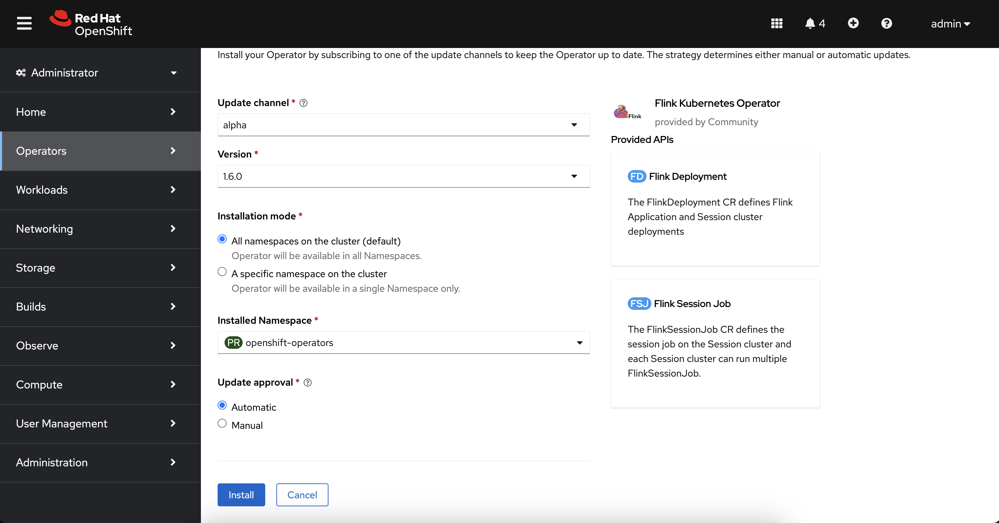

After the operator finishes installing, **we’ll create a new Flink deployment.** On the left menu, select `Installed Operators` and click `Flink Kubernetes Operator.` Under the Provided APIs, select `Flink deployment.` 

Switch the view to YAML and replace everything with the configuration below.

```
kind: FlinkDeployment
apiVersion: flink.apache.org/v1beta1
metadata:
  name: flink-streaming
  namespace: openshift-operators
spec:
  image: 'flink:1.16'
  flinkVersion: v1_16
  flinkConfiguration:
    taskmanager.numberOfTaskSlots: '2'
  serviceAccount: flink
  jobManager:
    resource:
      memory: 2048m
      cpu: 1
  taskManager:
    resource:
      memory: 2048m
      cpu: 1
```
We’ll also **create a route** so we can access the Flink deployment. On the right hand menu, click Networking → Routes. Click `Create route`, change to the YAML view, and replace everything in the editor with the configuration below.

```
kind: Route
apiVersion: route.openshift.io/v1
metadata:
  name: flink-rest
  namespace: openshift-operators
  labels:
    app: flink-streaming
    type: flink-native-kubernetes
spec:
  to:
    kind: Service
    name: flink-streaming-rest
  tls: null
  port:
    targetPort: rest
```
**Next, we’ll deploy a Flink job** that transforms our call record data into a form that’s suitable for storage and viewing.

Under Location, navigate to the Flink deployment url. *If you get an error, make sure your browser didn’t change the “http” to “https”*

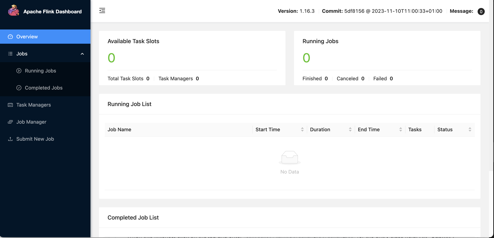

On the left menu, select `Submit New Job.` Click `+Add New` and upload [this jar](https://code-like-the-wind.s3.us-east-2.amazonaws.com/flink-streaming-1.0.jar). This may take a minute.

When this finishes, click on the job and enter `com.demo.flink.streaming.StreamingJob` for the entry class field. **Submit the job.**

## Generate Calls

Now, **we’ll generate some call record data.** Go back to the OpenShift console and switch to the Developer view.


Click `+Add` and select `Container Images` under the Developer Catalog. Fill in the properties below.

```
Image name from external registry: tolarewaju3/call-record-generator-amd64
Application: No application group
Name: call-record-generator
```
## Create Dashboard

We’ll create a dashboard that shows interesting facts about our data. [Metabase](https://www.metabase.com/) is a great library that makes it easy for us to visualize data.

### Deploy Metabase Analytics

First, we’ll create a database for the metabase container. On the left menu, switch to the developer view. Make sure the `openshift-operator` project is selected. Click the `+Add` button under the Developer Catalog. Select `Databases`.

Select MySql (Ephemeral), click Instantiate Template and use the properties below.

```
Namespace: openshift-operators
Database Service Name: metabasedb
MySQL Connection Username: tolarewaju3
MySQL Connection Password: tolarewaju3
MySQL Database Name: metabase
```
Next, we’ll **create our metabase container.** Click the “+Add” and select “Container Images”. Fill in the properties below.

```
Image name from external registry: metabase/metabase
Application: No application group
Name: metabase
```
Set environment properties on our container. On the bottom of the window, select “Deployment” and fill in the following variables.
```
MB_DB_TYPE: mysql
MB_DB_DBNAME: metabase
MB_DB_PORT: 3306
MB_DB_USER: tolarewaju3
MB_DB_PASS: tolarewaju3
MB_DB_HOST: metabasedb
```

**Wait until the deployment finishes.** You’ll see a dark blue ring around the pod.

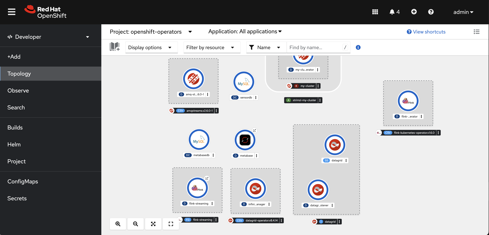

Open the Matabase dashboard. Click the link in the top right of the pod.

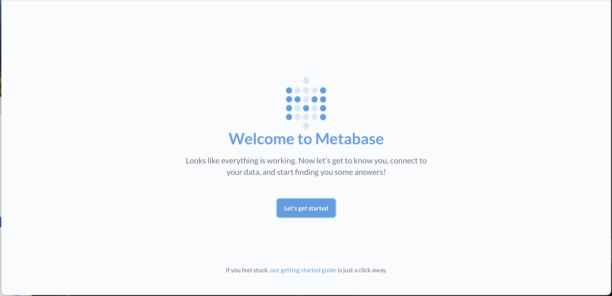

Click `Let’s get started` and fill in your information. Select `Self-service analytics for my own company` when asked what you'll be using Metabase for.

Select MySQL for the database and fill in the details below.

```
Display Name: Sensor Data
Host: sensordb
Database Name: sensor
Username: tolarewaju3
Password: tolarewaju3
```
Click Connect Database. Click Finish and “Take me to Metabase”.

### Create Call Record Dashboard

First, **we’ll create a new dashboard for our sensor data.** In the top right corner, select "New Dashboard".

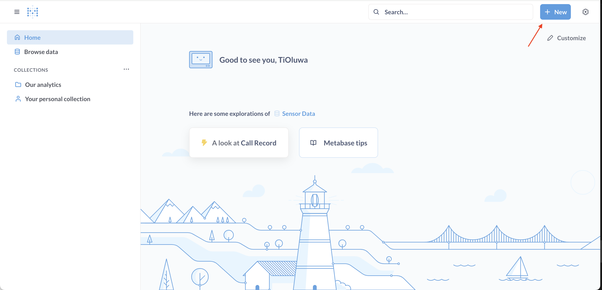

Name the dashboard `Sensor Data`. Click Create. And click save in the upper right corner.

Next, **we’ll display the total calls received** on our dashboard. In the upper right corner, click “+New → SQL Query". Select our Sensor Data database and enter the query below.

```
SELECT
  COUNT(*)
FROM
  `call_record`
```
Click the play button on the bottom right. You should see the number of calls displayed.

Hit “Save” on the top right. Name the question “Total Calls Received”. When prompted to add to a dashboard, select “Sensor Data”. Click Save.

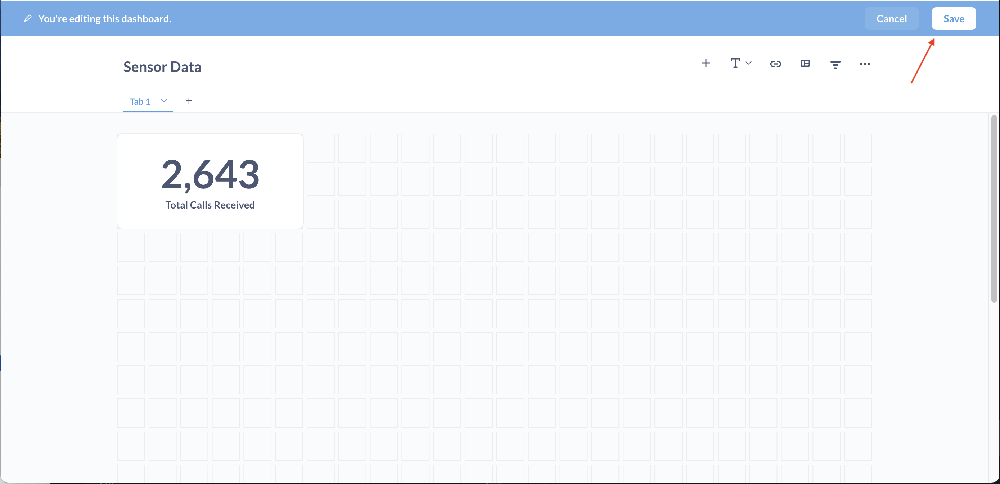

Next, **we'll display a table of all calls** on our dashboard. In the upper right corner, click “+New → SQL Query”. Select our Sensor Data database and enter the query below.

```
SELECT
  `call_record`.`timestamp` AS `Time`,
  `call_record`.`location` AS `Location`,
  `call_record`.`signalStrength` AS `Signal Strength`,
  `call_record`.`network` AS `Network`
FROM
  `call_record`
LIMIT
  100
```
Click the play button. You should see our call record data displayed in a table. Hit “Save” and name the question “All Call Records”. Add the query to the Sensor dashboard. 

Feel free to resize it make it things look pretty. **Click Save again.**

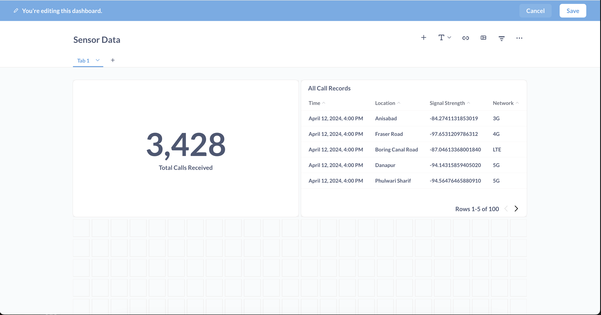

With the same steps above, display a graph of calls by location. Use the query below.

```
SELECT
  `call_record`.`location` AS `location`,
  COUNT(*) AS `count`
FROM
  `call_record`
GROUP BY
  `call_record`.`location`
ORDER BY
  `count` DESC,
  `call_record`.`location` ASC
LIMIT
  10
```
Click play on the bottom right. Hit the visualization button on the bottom left and select the bar chart. **Save the question.** Name it “Calls by Location” and add it to our dashboard. Hit Save.

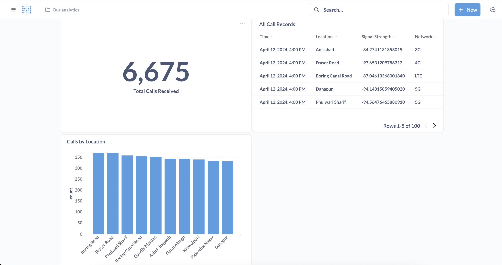

Finally, we'll display a pie chart of the calls by network type. Use the steps above and the query below.

```
SELECT
  `call_record`.`network` AS `network`,
  COUNT(*) AS `count`
FROM
  `call_record`
GROUP BY
  `call_record`.`network`
ORDER BY
  `call_record`.`network` ASC
```

Click the play button on the bottom. Select Visualization and choose a pie chart. Save the question and name it “Calls by Network Type”. 

When you're done, your dashboard should look like this.

